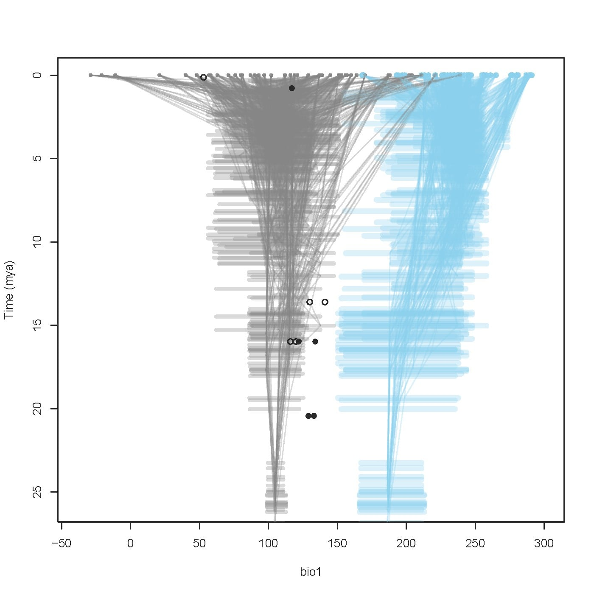

```{r, include = FALSE}
knitr::opts_chunk$set(
  collapse = TRUE,
  comment = "#>"
)
```

```{r setup}
# Load the package and dependencies
library(ppgm)
```

PaleoPhyloGeographic Models (PPGM) are a useful way to incorporate paleontological data into analysis of climatic niche shifts in modern taxa.

Here we will walk you through the basic steps of the PPGM workflow, using the included data within the package.

## Input Data

Three things are needed to run a PPGM. Species occurrences, a **dated** phylogenetic tree, and paleoclimate data. Fossils are optional but highly recommended.

There are many sources for species occurrences, which will depend on your specific analysis. For instructions on how to find and clean extant species occurrence data, please see this [webpage](https://lawinglab.org/ppgm/).

### Extant Data

We are using the *Sceloporus* data included in the package. This data was first collected for Lawing et al (2016).

After loading the package, you can load the data using the `data` function

```{r load occurrence data}
# load Sceloporus occurrence data
data(occurrences)
```

This file contains *Sceloporus* occurrences for 53 species, Longitude and Latitude for each occurrence point, and all 19 bioclimatic variables for each of these points.

Only the first 3 columns are required for PPGM to run, as there is code that extracts bioclimate variables from the first layer of paleoclimate data. If the bioclimatic variables are included in the input dataset, then the package will default to estimating climate envelopes using these variables, rather than the paleoclimate data.

All 19 bioclimatic variables must be included if including any bioclimatic variables at this stage. If some variables are known, the columns may be left blank

```{r view occurrence}
# View the occurrence data to check all in order
head(occurrences,n=3)
```

### Phylogenetic Trees

PPGM requires **dated** phylogenetic trees. This is so that the code can associate ages of nodes with appropriate paleoclimate layers.

A sample of the Leache & Sites (2010) phylogenetic trees, trimmed for *Sceloporus* analysis by Lawing et al (2016), is included in the package. For the current analysis in the vignette we will use a subset of this dataset, in order to save computational time.

These trees can be accessed using the `data` function.

We will store 10 trees in the variable `vigtrees` for this analysis to save on computational time. A larger number of phylogenies will increase computational time. We recommend using the inbuilt parallel function to speed large analyses up, see later.

```{r load trees}
# Load the Sceloporus phylogenies and select only 10
data(sampletrees)
vigtrees <- sample(sampletrees, size=10)
```

### Paleoclimate Data

We include a sample paleoclimate dataset within the package. This is a dataset

### Fossil Data

We will also use the *Sceloporus* fossil dataset collected for Lawing et al (2016), representing a sampling of fossils from the literature. This dataset includes 45 *Sceloporus* fossils identified to the genus level.

This dataset is included in the package, and can be accessed using:

```{r load fossils}
data("scel_fossils")
head(scel_fossils)
```

This dataset includes minimum and maximum age for each fossil, with longitude and latitude for each point.

Fossil data is in the format of a table. It is important that the ages are in the first two columns, not the name of the species as with the modern occurrences.

## Set Up Analysis

### Bounds

PPGM uses phylogenetic comparative techniques to estimate climatic envelopes through time. Setting appropriate bounds is an important step. When no bounds are included, `ppgm` will use the default bounds from the `fitContinuous` function, which is likely not appropriate for analysis of climate niche.

Here we will set up a reasonable bounds for this analysis, using bioclimatic variable 1 (Mean Annual Temperature)

First we can look at the summary of bio1 in the occurrences dataset, using `getBioclimVars`.

```{r examine bio1}
bio1occ <- getBioclimVars(occurrences = occurrences, which.biovars=1)
summary(bio1occ$bio1)
```

The minimum Mean Annual Temperature gets is -29 , and the max is 291, so we can use these values to give an idea for the bounds.

NOTE: If using multiple variables, you should use the bounds for the largest number. For example, seasonality:

```{r examine bio4}
bio4occ <- getBioclimVars(occurrences = occurrences, which.biovars=4)
summary(bio4occ$bio4)

```

PPGM will use the same bounds for all biovariables, so make sure to set bounds accordingly.

Here we will set bounds for the bio1 and bio4 analysis for a Brownian Motion model.

```{r set BM bounds}
# Set bounds for Brownian Motion
bmbounds <- list(sigsq = c(min = 0, max = 10000))
```

And set bounds for the bio1 analysis for an Ornstein-Uhlenbeck model.

```{r set OU bounds}
# Set bounds for OU
oubounds <- list(sigsq = c(min = 0, max = 1000000),alpha = c(min = 0, max = 100000))
```

### Control

Remember to also set a control. These are the settings used by `fitContinuous` to optimize the model likelihood.

```{r set control}
#set control for model
contr <- list(niter=20)
```

## Run PPGM

PPGMs can be run for a variety of models, and using either just present occurrences, or fossil and present occurrences. The 'present' is set by the youngest tips in the phylogeny - PPGMs run on extinct clades must take this into account.

### Many Trees - No Fossils - Brownian Motion

For this first run, we will show a ppgm run with 10 trees and no fossils.

We will use our previously made objects, `occurrences` and `vigtrees`.

To select biovariables 1 and 4 we use `which.biovars = c(1,4)`.

To select the Brownian Motion model we use `model = "BM"`.

To view results in the format of a TraitGram, we use the parameter `plot.TraitGram` and set it to `TRUE`.

To change the default name of the output (which defaults to bio[#]), we use `path = "BM"`. This will add the characters "BM" to the start of every plot name produced by the PPGM.

To speed up processing time when using multiple phylogenies, you can add the parameter `use.parallel = TRUE`. This will detect the number of cores on the current machine and run the node estimation process on multiple cores.

```{r run ppgm 1 BM no fossils}
ppgm_bm <- ppgm(occurrences, trees = vigtrees, bounds = bmbounds, control = contr, 
                    which.biovars = c(1,4), model = "BM",  path = "BM")

```

If you add the argument plot.TraitGram = TRUE, you will get a figure in your working directory called "BMbio1.pdf" and "BMbio4.pdf".

Let's take a look at the traitgram for mean annual temperature (bio 1).

```{r image-ppgm-nofossils-bm-bio1, echo = FALSE, message=FALSE, fig.align='center', fig.cap='Traitgram showing Mean Annual Temperature', out.width="75%", fig.pos='H'}

```

This is a traitgram for the mean annual temperature variable. The minimum is shown in grey, and the maximum in blue.

Below is the traitgram for temperature seasonality.

```{r image-ppgm-nofossils-bm-bio4, echo = FALSE, message=FALSE, fig.align='center', fig.cap='Traitgram showing Temperature Seasonality', out.width="75%", fig.pos='H'}
knitr::include_graphics("images/BMbio4.jpg")
```

### Many Trees - No Fossils - Ornstein Uhlenbeck

Let's have a look at the outputs from another commonly used model, OU.

Remember that this model uses different bounds.

```{r run ppgm 2 OU no fossils}
ppgm_ou <- ppgm(occurrences, trees = vigtrees, bounds = oubounds, control = contr, 
                    which.biovars = c(1,4), model = "OU", path = "OU")

```

You can also examine how the reconstructed climate for each node differs from the Brownian Motion in the traitgram.

```{r image-ppgm-nofossils-OU-bio1, echo = FALSE, message=FALSE, fig.align='center', fig.cap='Traitgram showing Mean Annual Temperature', out.width="75%", fig.pos='H'}

```

```{r image-ppgm-nofossils-OU-bio4, echo = FALSE, message=FALSE, fig.align='center', fig.cap='Traitgram showing Temperature Seasonality', out.width="75%", fig.pos='H'}

```

### PPGM results

The `ppgm` function produces a list of outputs that can be used separately with other functions in the package, or with further downstream analysis. Let's take a look at these.

#### Climate Envelope

The climate envelope for each species is stored in `cem`. This contains the minimum, mean, and max, for the biovariable used in the ppgm workflow. As we have included two variables (bio1 and bio4), we have 6 columns.

```{r climate envelope output}
head(ppgm_bm$cem)
```

The output `envelope` is a list (of however many trees) containing the climate envelope of each node of the tree. This is used downstream in the function `getLineageClimate` and is the equivalent to the output of the function `getEnvelopes`.

```{r climate envelope output2}
head(ppgm_bm$envelope[[1]])
```

#### Treedata Objects

The outputs `treedata_min` and `treedata_max` contain the minimum values and maximum climatic variables for every tree.

Here we can take a look at the data that is in the first tree:

```{r}
head(ppgm_bm$treedata_min[[1]]$data)
```

If you didn't plot a traitgram during the initial run of the PPGM, these outputs can be used in the functions `plotTraitGram` (for a single phylogeny) or `plotTraitGramMultiPhylo` (for many phylogenies).

### Viewing climate envelope occupancy geographically - MESS

The traitgram results show how these individual bioclimatic variables change through time. To see how these relate to geographic space, we can create a MESS map.

MESS, multivariate environmental suitability surfaces

To put the output of ppgm in the correct format, we need to extract the minimum and maximum climate envelope from the `cem` object. We need columns 1 and 2 for minimum, and 4 and 6 for the maximum. We also need to make sure that the row names from the `cem` output are retained.

```{r format output for ppgmMESS}
cem_min <- cbind(ppgm_bm$cem[,1], ppgm_bm$cem[,2])
cem_max <- cbind(ppgm_bm$cem[,5], ppgm_bm$cem[,6])
rownames(cem_min) <- rownames(cem_max) <- rownames(ppgm_bm$cem)
```

Now we can calculate the MESS scores and create the MESS map. We select the option `which.plot="mess"` to select the MESS map.

```{r run ppgmMESS}
mess <- ppgmMESS(cem_min, cem_max, ppgm_bm$node_est, tree = vigtrees, timeslice = 15,
                 which.biovars = c(1,4), which.plot = "none")
```

This will produce a plot in the working directory for the timeslices selected using the option `timeslice`. As we selected timeslice 15 (representing 15 mya), we get a plot of the reconstructed climate niche availability at 15 mya for the entire clade, output as a plot called "MESS15Multi.pdf".

```{r image-ppgm-15mess, echo = FALSE, message=FALSE, fig.align='center', fig.cap='MESS at 15mya', out.width="75%", fig.pos='H'}

```


## A PPGM with Fossils

A PPGM can be run with fossils, and we recommend running a PPGM with and without fossils to see what the effect of fossil inclusion can have on the reconstruction of climate niche tolerances through time. The set up for the PPGM is the same as with the extant PPGM, only now we will use our dataset of fossils.

Here we'll select the first 6 fossil occurrences, to show how only a few fossils can have a really interesting effect on results

```{r}
vigfossils <- head(scel_fossils)
```
This dataset includes 45 fossil *Sceloporus* occurrences ranging from early Miocene to late Pleistocene that are identified to genus level, but species identification is not possible.

One of the good things about PPGM is that we can include these fossils even though their taxonomic position is unknown. When fossils with unknown phylogenetic placement are included in the `ppgm`, the workflow utilises the function `addFossil` to randomly add fossils to appropriate branches that are present in the phylogeny within the age range of the fossil as given.

Here we will run a ppgm with the same variables as the previous models to see the changes that happen when fossils are included.

As the fossils are being added to the tree randomly, we can account for the uncertainty in node placement introduced by alternate fossil positions by increasing the number of permutations. Here we'll set the number of permutations to 5 using `permut = 5`, however you can experiment with your own data to see how many permutations are necessary to include the range of uncertainty in node estimation.

Increasing the number of permutations will increase the computational time, so be aware that this step could take some time depending on your personal machine.

```{r ppgm run with fossils}
ppgm_bmfossil <- ppgm(occurrences, trees = vigtrees, fossils = vigfossils, bounds = bmbounds,
                      control = contr, which.biovars = c(1,4), model = "BM",
                      path = "BMfossil", permut = 5)
```
We can compare the results with the extant only ppgm

```{r image-ppgm-nofossils-bm-bio1-again, echo = FALSE, message=FALSE, fig.align='center', fig.cap='Traitgram without fossils showing Mean Annual Temperature', out.width="75%", fig.pos='H'}

```
```{r image-ppgm-fossils-bm-bio1, echo = FALSE, message=FALSE, fig.align='center', fig.cap='Traitgram with fossils showing Mean Annual Temperature', out.width="75%", fig.pos='H'}

```
Even with the addition of only 6 fossils, the traitgram shows that the model reconstructs a different ancestral state for the climate tolerance of the Sceloporus total clade.

We can also create a MESS map with the fossil run and compare.

Format output for MESS as before:

```{r format fossil output for ppgmMESS}
fcem_min <- cbind(ppgm_bmfossil$cem[,1], ppgm_bmfossil$cem[,2])
fcem_max <- cbind(ppgm_bmfossil$cem[,5], ppgm_bmfossil$cem[,6])
rownames(fcem_min) <- rownames(fcem_max) <- rownames(ppgm_bmfossil$cem)
```
Run the MESS analysis for the fossil ppgm. Change the below code to say `which.plot = "all"`.

```{r run fossil ppgmMESS}
mess_fossil <- ppgmMESS(fcem_min, fcem_max, ppgm_bmfossil$node_est, tree=vigtrees, timeslice=15,
                        which.biovars = c(1,4), which.plot = "none", fossils = vigfossils,
                        path = "fossil")
```


```{r image-ppgm-15mess-nofossils, echo = FALSE, message=FALSE, fig.align='center', fig.cap='MESS at 15mya, no fossils', out.width="75%", fig.pos='H'}

```
```{r image-ppgm-15mess-fossils, echo = FALSE, message=FALSE, fig.align='center', fig.cap='MESS at 15mya, fossils', out.width="75%", fig.pos='H'}

```

As you can see the MESS map using fossils is very different, suggesting climatic tolerances for *Sceloporus* much more North than using extant occurrences alone. This changes our understanding of where suitable climate for *Sceloporus* was during their early evolutionary history.

